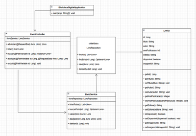

# Biblioteca Digital (Spring Boot + MySQL)

[](https://github.com/Brunacoelhob/estudo-java-biblioteca-springboot/actions/workflows/ci.yml)


Sistema web para gestão de uma biblioteca: **API REST** em Spring Boot e **front-end** em HTML/CSS/JS puro. Nasceu como estudo de caso de Programação Orientada a Objetos e foi refinado para práticas de produção.



## Funcionalidades

- Cadastrar, listar, editar e excluir livros (título, autor, ano, editora, disponibilidade e capa por URL)
- Busca por título ou autor (`GET /livros?busca=`)
- Documentação interativa da API (Swagger UI)

## Arquitetura

```
frontend (nginx) ──► controller ──► service ──► repository ──► MySQL
                      (HTTP/DTOs)    (regras)     (JPA)        (Flyway)
```

| Camada | Responsabilidade |
|---|---|
| `controller` | Rotas REST, validação (`@Valid`) e códigos HTTP corretos (201 + `Location`, 204, 404…) |
| `dto` | Contratos de entrada/saída. A entidade nunca vai para fora e o cliente não controla o `id` |
| `service` | Regras, transações, normalização dos dados |
| `repository` | Spring Data JPA |
| `exception` | Respostas de erro padronizadas (RFC 9457) sem vazar detalhes internos |

## Melhorias em relação à primeira versão

| Antes | Agora |
|---|---|
| Senha do banco no `application.properties` | Variáveis de ambiente (`DB_PASSWORD` obrigatória) |
| Entidade exposta direto na API (*mass assignment*) | DTOs + validação (tamanhos, ano, URL `http(s)`) |
| Excluir/atualizar id inexistente → erro 500 | 404 com mensagem clara |
| PUT não atualizava a imagem | Corrigido |
| `ddl-auto=update` | Migrações versionadas com Flyway + `validate` |
| CORS fixo no código e classe vazia duplicada | Origens configuráveis (`CORS_ORIGENS`) |
| **XSS armazenado** no front (`innerHTML` com dados da API) | DOM seguro (`textContent`) e só `http(s)` em imagens |
| Capa padrão em serviço externo morto | Placeholder embutido |
| Spring Boot 3.2 / Java 17, `System.out.println` | Boot 3.4 / Java 21, logs via SLF4J |
| Sem testes, sem Docker, sem CI | 16 testes (API ponta a ponta + serviço), Docker Compose e CI |

## Como executar

### Com Docker (recomendado)

```bash
cp .env.example .env                  # defina DB_PASSWORD
docker compose up -d --build --wait
```

- Front-end: http://localhost:8081
- Swagger: http://localhost:8080/swagger-ui.html
- Saúde: http://localhost:8080/actuator/health

### Sem Docker

Requer Java 21, Maven e um MySQL com o banco `biblioteca_digital` criado.

```bash
export DB_PASSWORD=sua_senha          # opcionais: DB_URL, DB_USER, CORS_ORIGENS
mvn spring-boot:run
```

Abra `frontend/index.html` por um servidor estático (ex.: extensão Live Server na porta 5500).

## Testes

```bash
mvn verify
```

Os testes sobem a aplicação inteira com H2 em modo MySQL, executando as mesmas migrações Flyway de produção.

## Limitações conhecidas

- A API **não tem autenticação**: qualquer cliente que alcance a porta 8080 pode alterar o acervo. É adequada para estudo/uso local; para publicar, adicione Spring Security (ex.: JWT) e HTTPS.
- Sem paginação na listagem (o acervo de estudo é pequeno).

## Licença

[MIT](LICENSE)
